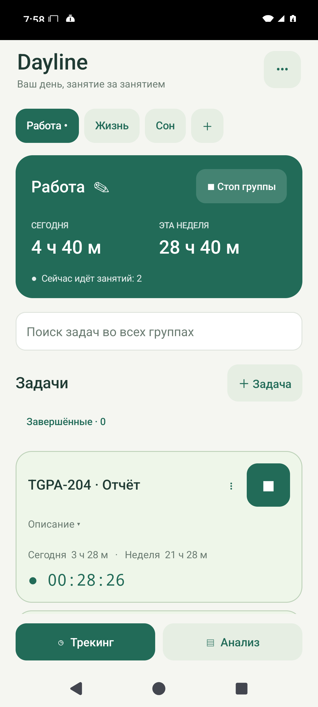
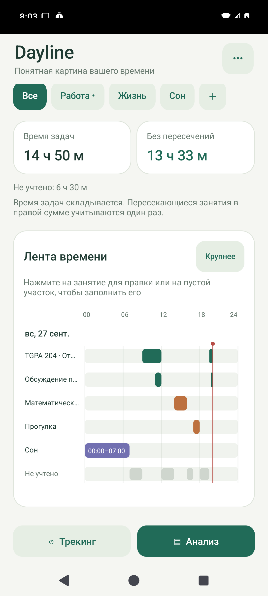
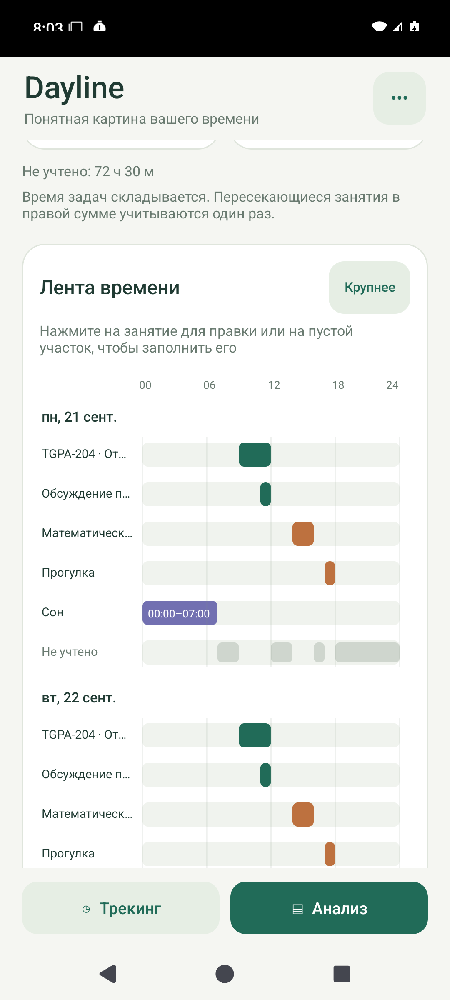
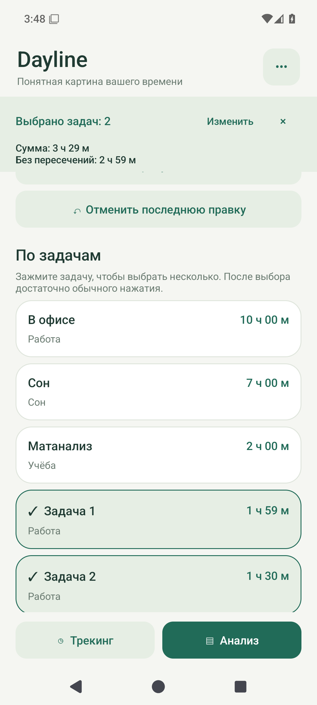
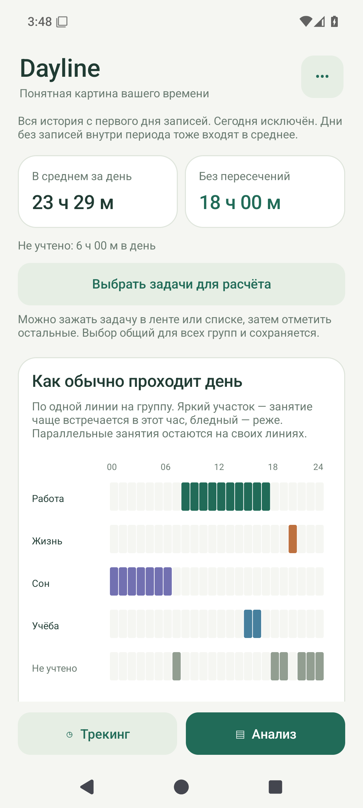
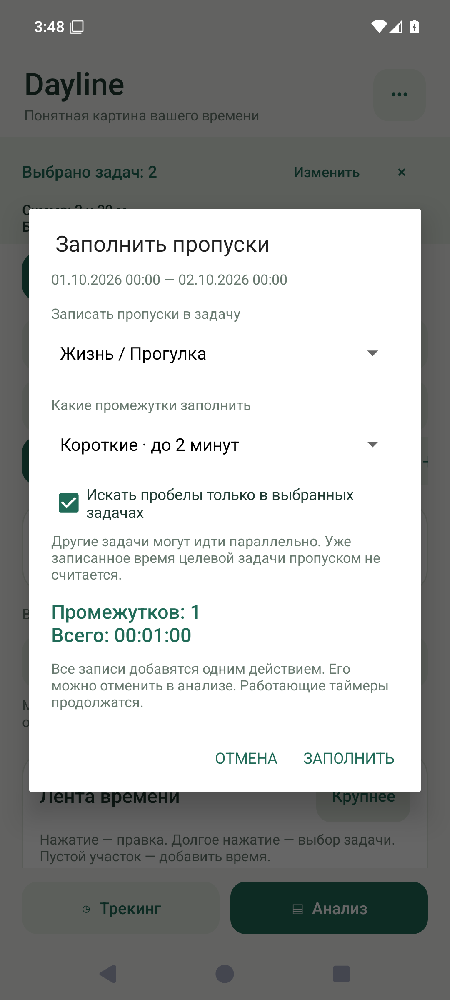

# Dayline

Личный Android-трекер времени: несколько таймеров одновременно, лента суток и недели, простое исправление записей и готовый Excel-отчёт.

## Установка

Скачайте `Dayline-1.1.0.apk` из [последнего выпуска](https://github.com/lotossoks/dayline-android/releases/latest) и откройте на телефоне. При первой установке Android попросит разрешить установку из выбранного браузера или приложения «Файлы».

Требуется Android 8.0 или новее. Приложение работает на одном телефоне, без аккаунта, рекламы и доступа к интернету.

## Интерфейс

На снимках — демонстрационные данные.

  

## Новое в 1.1.0

  

**Обновление с 1.0.0:** откройте новый APK поверх установленного Dayline и выберите «Обновить». Удалять старое приложение не нужно. Идентификатор приложения, подпись и формат базы сохранены. На Android 15 проверена установка 1.1.0 поверх 1.0.0: все таблицы с задачами, описаниями, историей и активными таймерами остались неизменными.

### Выбор задач

В анализе зажмите задачу в списке **«По задачам»** или на временной ленте. Затем обычными нажатиями добавляйте и снимайте задачи. Сверху закрепляются сумма времени и занятость без пересечений. Крестик закрывает выбор.

Кнопка **«Выбрать задачи для расчёта»** открывает поиск и флажки. Для расчёта всего дня без задачи «В офисе» нажмите «Все задачи» и снимите флажок у «В офисе». Выбор общий для всех групп и сохраняется между запусками. Переключение дня или недели меняет период расчёта; в недельном анализе есть обе суммы по каждому дню. В Excel можно включить только выбранные задачи — остальные занятия попадут в «Другое».

### Средний день

Откройте **Анализ → Среднее**. Здесь два представления:

- Средние длительности задач и групп: сколько часов в день занимают работа, сон, офис и другие занятия. Для групп и общей суммы показан также результат без пересечений.
- Почасовая картинка с отдельной линией для каждой группы. Цвет показывает долю времени внутри часа: насыщенный — занятие встречалось чаще, бледный — реже. Параллельные группы не вытесняют друг друга. Нажатие показывает точную долю и минуты в часе; есть текстовая расшифровка.

Среднее считается по всей истории завершённых календарных дней, начиная с первого дня записей. Сегодня исключён; пустые дни внутри истории включены в знаменатель. Можно выбрать все дни или отдельно понедельники, вторники и остальные дни недели. Внизу есть сводка средней недели с переходом к каждому дню. Фильтр выбранных задач действует и здесь.

Линии соответствуют вашим группам: например, «Сон», «Работа», «Учёба», «Жизнь». Для отдельной линии учебных занятий создайте группу «Учёба» и отнесите к ней соответствующие задачи. Диаграмма показывает историю, а не планирует будущие занятия. При фильтрации незанятые выбранными задачами часы подписываются «Вне выбора», а не выдаются за отсутствие всех записей.

### Заполнить пропуски

В анализе дня или недели нажмите **«Заполнить все пропущенные моменты»**, выберите задачу и длину пропусков: до 2, 5, 15 минут либо все. До применения видны количество промежутков и общая длительность. Все добавленные записи можно отменить одним действием.

По умолчанию пропуски ищутся среди **всех записей**, независимо от фильтра анализа. При активном выборе можно включить поиск пробелов только между выбранными задачами — полезно, если «В офисе» перекрывает весь день. Время, уже записанное в целевую задачу, всегда защищено от повторного заполнения. Будущее время не заполняется; работающие таймеры продолжаются.

## Ежедневное использование

- Приложение открывается в режиме **«Трекинг»**. Переключайте группы свайпом по списку или нажатием на вкладку.
- Нажмите **«＋ Задача»**, затем **▶**. Можно включить несколько задач одновременно. Активные задачи поднимаются в начало своей группы.
- **«Стоп группы»** завершает только таймеры выбранной группы. В других группах учёт продолжается.
- На карточках показано время за сегодня и текущую неделю; у активной задачи — ещё и длительность текущего запуска.
- Сон запускается и останавливается вручную, как обычная задача.
- Поиск работает по названиям во всех группах. Завершённые задачи доступны отдельным списком.
- Нажатие на название задачи открывает историю. Меню **⋮** позволяет изменить задачу, добавить время или завершить её. Завершение останавливает таймер, сохраняя все записи.
- Группу можно переименовать и перекрасить нажатием на её название с символом **✎**. Новая группа добавляется кнопкой **＋** у вкладок.

## Анализ и исправления

**«Анализ»** показывает день или календарную неделю. Можно перейти к предыдущим периодам и отфильтровать группу. Произвольных диапазонов дат нет.

- **Время задач** — сумма длительностей всех записей, включая параллельные.
- **Без пересечений** — фактическая занятость: одна минута считается один раз.
- **Не учтено** — прошедшее время без каких-либо записей. При выборе группы вместо этого показывается время **вне этой группы**.

Неделя начинается в понедельник, сутки — в 00:00 по текущему часовому поясу телефона. Переходящий через полночь сеанс сохраняется целиком, а в итогах распределяется между соответствующими днями.

Нажмите на отрезок ленты или запись в истории, чтобы изменить границы, вырезать участок либо перенести его в другую задачу. Нажатие на пустой участок открывает добавление времени с уже подставленными границами. Для правки работающего сеанса сначала предлагается остановить его.

Последнюю правку можно отменить в анализе. Отмена доступна до следующего изменения данных или закрытия процесса. Пересечения **разных** задач разрешены, а повторный учёт одного и того же времени внутри **одной** задачи отклоняется с объяснением.

## Excel

Экспорт создаёт настоящий `.xlsx` с готовыми числами, датами, фильтрами, закреплёнными заголовками и шестью листами:

1. **Обзор недели** — главные показатели и пояснения.
2. **Лента недели** — занятия по дням и часам. В часовых ячейках показаны учтённые минуты.
3. **По дням** — обе суммы времени и незаполненные промежутки.
4. **По группам** — длительности, доли и количество записей.
5. **По задачам** — время, доля, описание и статус задачи.
6. **Интервалы** — точные начала и окончания записей в пределах недели.

Можно экспортировать все группы или одну, например **«Работу»**. В отчёте по одной группе остальные занятия объединяются на ленте в **«Другое»**: их названия, группы и описания в файл не записываются. Параллельные личные занятия объединяются без двойного счёта. **«Не учтено»** остаётся отдельной строкой.

Отчёт — снимок на момент экспорта. Итоги уже рассчитаны; последующие правки ячеек не пересчитывают готовый снимок. Чтобы получить свежие данные, повторите экспорт. Интервалы работающих таймеров заканчиваются в отчёте временем его создания, сами таймеры продолжаются.

## Сохранность данных

Каждый запуск и остановка сразу сохраняются в SQLite. Длительность рассчитывается по сохранённым временным отметкам, а не по числу срабатываний фонового процесса. Сворачивание и перезапуск приложения не сбрасывают таймеры. Работающие таймеры продолжаются и после перезагрузки телефона.

Для удобного управления разрешите уведомления. На vivo/Funtouch OS также разрешите фоновую работу Dayline в настройках батареи, если система скрывает уведомление. Ограничения производителя могут мешать уведомлениям; сохранённые записи от этого не удаляются.

В меню **•••** можно сохранить и восстановить JSON-копию всей истории. В копии активные сеансы фиксируются на момент сохранения, поэтому после восстановления не появляются таймеры, случайно считающие с даты создания копии. Восстановление требует подтверждения и заменяет текущие данные. Обычное обновление APK с той же подписью сохраняет базу; удаление приложения удаляет его локальные данные.

При изменении группы задачи её история также относится к новой группе; это явно указано в редакторе.

## Для разработки

Нативное приложение на Java 17 и Android Views, без сторонних библиотек времени, базы данных и экспорта. `minSdk 26`, `compileSdk/targetSdk 34`. Gradle 8.7, Android Gradle Plugin 8.5.0.

```bash
# Android SDK укажите через ANDROID_HOME либо local.properties.
./scripts/test-core.sh
./gradlew :app:assembleDebug :app:assembleDebugAndroidTest :app:lintDebug
```

Тесты на Android-устройстве или эмуляторе:

```bash
adb install -r app/build/outputs/apk/debug/app-debug.apk
adb install -r app/build/outputs/apk/androidTest/debug/app-debug-androidTest.apk
adb shell am instrument -w app.dayline.test/app.dayline.DaylineInstrumentation
```

Для подписанной сборки создайте **локальный, не коммитящийся** `signing.properties` с ключами `storeFile`, `storePassword`, `keyAlias`, `keyPassword`, затем выполните `./gradlew :app:assembleRelease`. Сохраните ключ подписи отдельно: он нужен для будущих обновлений установленного приложения. APK публикуются в GitHub Releases, а не в исходных файлах Git.

[Требования](docs/requirements.md) · [Устройство](docs/development.md) · [Результаты проверок](docs/validation.md)
